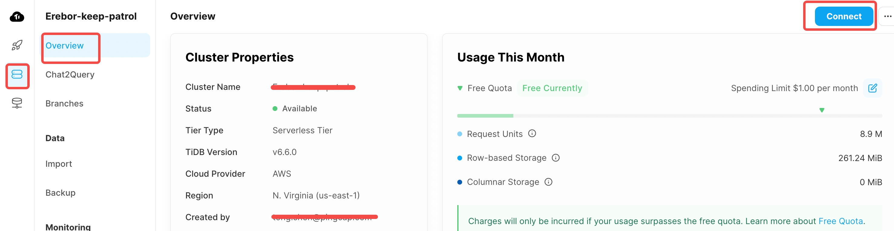
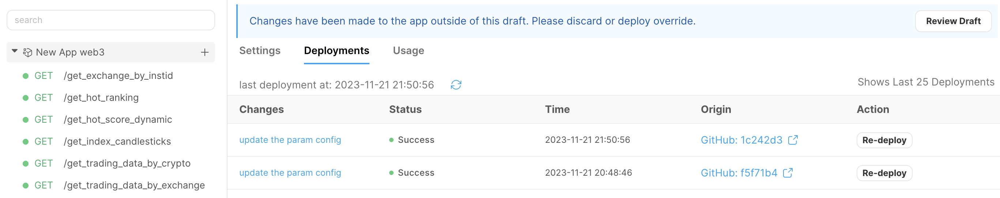
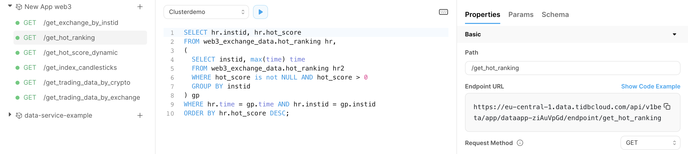
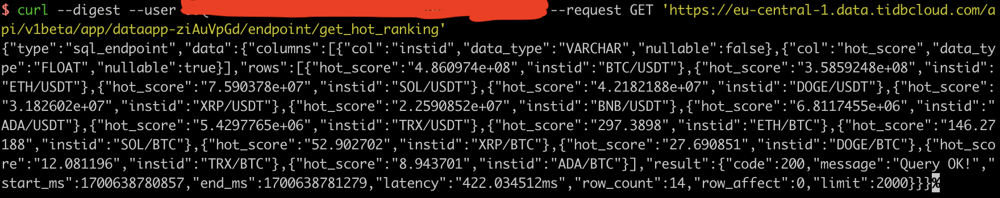
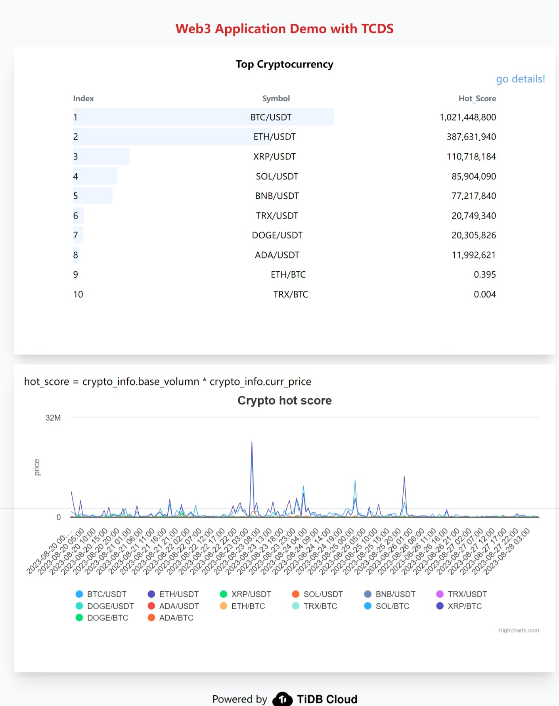

# TiDB Cloud Data Service Guide —— Web3 APP

TiDB Cloud is a powerful and user-friendly cloud-based database platform. This comprehensive guide aims to offer detailed instructions on leveraging the TiDB Cloud Data Service(TCDS) to construct a straightforward dashboard app using less than 100 lines of code.

In order to implement your own web3 app, make sure you have understood the basic usage of TCDS, if not, go through the following

- [Example of basic TCDS usage](https://github.com/tidbcloud/data-service-example)

## Prepare the data source

Once your cluster is set up, you can start importing data from cryptocurrency exchanges. The app mainly focuses on the market data of cryptocurrency: the price of the cryptocurrency, candle chart and other information.

1. Log in to [tidbcloud.com](https://tidbcloud.com) and select the Cluster project from the left sidebar. Click `connect` button to get a `mysql` command.

2. Get the host, port, user, password, database from your `mysql` command.

3. Using the program in the backend folder, replace your SQL information and import the data you want. Refer to the [README.md](./backend/README.md) in the backend folder for details.

## Step-by-step: build & deploy

Refer to the [README.md](https://github.com/tidbcloud/data-service-example/blob/master/README.md#step-by-step-build--deploy).

### Create a new DataAPP in TiDB Cloud

- Follow to the [README.md](https://github.com/tidbcloud/data-service-example/blob/master/README.md#create-a-new-dataapp-in-tidb-cloud),create a new DataAPP and select the appropriate cluster.

### Associate your github repo with TiDB Cloud DataAPP

- Copy front_end as one of your github repo.
- Refer to the [README.md](https://github.com/tidbcloud/data-service-example/blob/master/README.md#associate-your-github-repo-with-tidb-cloud-dataapp) to do the following.
  - Connect your github repo with DataAPP.
  - Trigger the DataAPP deployment via git push

At this point, go back to the webpage of the DataAPP, and you will see a deployment record from GitHub. This deployment record is triggered and deployed through GitHub.+

We have completed the creation of DataAPP and now we are testing if our newly created DataAPP works appropriately.

#### Create an ApiKey {publickey}:{privatekey} in DataAPP and save it to local.

#### Choose an endpoint and test if it is working correctly.

Click on any endpoint in DataAPP and click code example in the right side panel; click online environment in the pop-up window, copy the curl command in it to local.

Replace the fields `<PublicKey>` and `<PrivateKey>` in the copied content with the previously generated `public key` and `private key`. Send the request on the command line. If the corresponding data is returned normally, it indicates that the current DataAPP has been set up successfully.

### Launch the web application

Refer to the [README.md](https://github.com/tidbcloud/data-service-example/blob/master/README.md#launch-the-web-application)

#### Build and deploy the web app demo

Refer to the [README.md](https://github.com/tidbcloud/data-service-example/blob/master/README.md#build-and-deploy-the-web-app-demo)

- Clone your github repo to local, create a `.env` file in the root directory to specify some environment variables that shouldn't be hardcoded in the source code and can be easily changed on-the-fly.
- Run `npm i && npm run dev` to start a local dev sever, click the url `http://localhost:3000` in the command line to see the demo.
- Deploy our demo app to [Vercel](https://vercel.com/).

### Check the result

Upon successful deployment, the functioning of the app would look like the following, and we've finished the production deployment!

